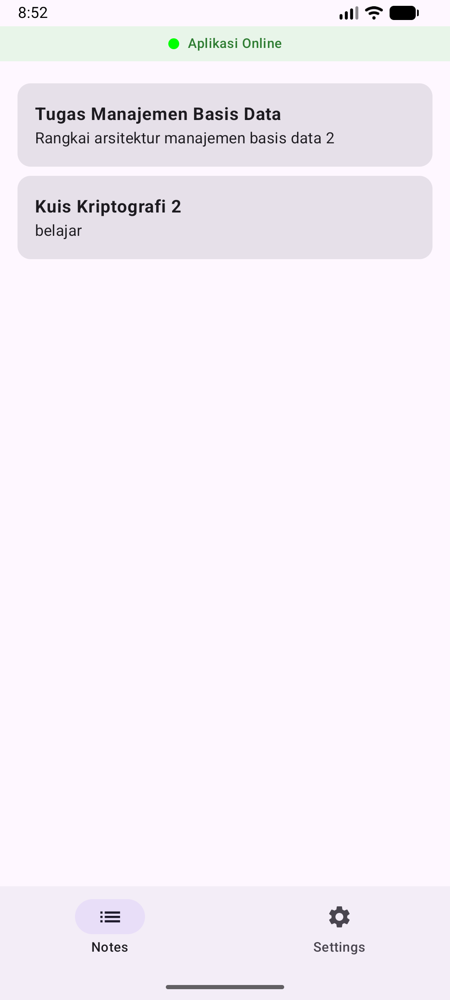
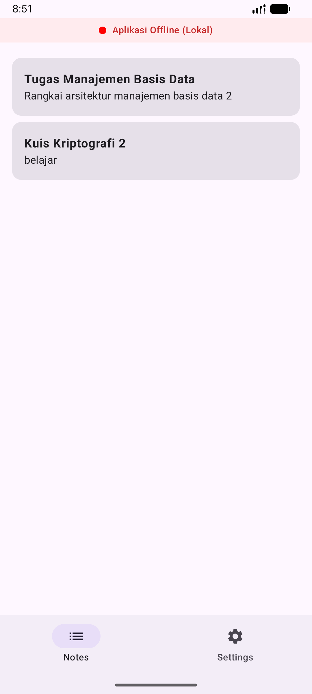

# Note App - Kotlin Multiplatform (Tugas SQLDelight & Dependency Injection)

Aplikasi manajemen catatan (Notes) modern yang dibangun menggunakan **Compose Multiplatform**. Proyek ini mengimplementasikan sistem penyimpanan data lokal yang efisien, manajemen preferensi pengguna, fitur lintas platform menggunakan mekanisme *expect/actual*, dan Dependency Injection terpusat menggunakan Koin.

Link Video Aplikasi [here](https://youtu.be/df_EwUsrPUI)

## Fitur Utama

### 1. Operasi CRUD (SQLDelight)
Manajemen data catatan dilakukan sepenuhnya di database lokal menggunakan **SQLDelight** yang bersifat *type-safe*:
- **Create**: Menambahkan catatan baru dengan judul dan isi konten.
- **Read**: Menampilkan daftar catatan secara real-time dari database SQLite.
- **Update**: Mengedit konten catatan atau mengubah status favorit.
- **Delete**: Menghapus catatan dari penyimpanan lokal secara permanen.

### 2. Fitur Pencarian (Search Functionality)
Dilengkapi dengan fitur pencarian yang responsif. Pengguna dapat mencari catatan berdasarkan kata kunci pada judul maupun isi konten secara instan melalui query SQL yang dioptimalkan.

### 3. Pengaturan (Settings) dengan DataStore
Mengelola preferensi pengguna secara persisten menggunakan **Jetpack DataStore**:
- **Theme Selection**: Beralih antara Tema Terang (Light) dan Tema Gelap (Dark).
- **Sort Order**: Mengatur urutan tampilan catatan (berdasarkan waktu terbaru atau terlama) yang tersimpan secara permanen di DataStore.

### 4. Setup Koin Dependency Injection
Menggunakan **Koin** untuk menangani injeksi dependensi di seluruh aplikasi secara konsisten:
- **Injeksi Terpusat**: Seluruh komponen utama seperti `NoteDataSource`, `NetworkMonitor`, `DeviceInfo`, dan `SettingsDataSource` di-inject melalui Koin, menghindari instansiasi manual di dalam UI.
- **Modularitas**: Pemisahan antara `appModule` (Common) dan `platformModule` (Android/iOS) untuk manajemen objek yang lebih bersih dan sesuai dengan kebutuhan masing-masing platform.

### 5. Implementasi Fitur Platform (Expect/Actual)
Menggunakan mekanisme **expect/actual** untuk mengakses API spesifik pada masing-masing platform:
- **DeviceInfo**: Mendapatkan detail teknis perangkat (Model dan Versi OS) baik di Android maupun iOS. Implementasi ini memungkinkan aplikasi menampilkan informasi yang relevan dengan perangkat pengguna.
- **NetworkMonitor**: Memantau status koneksi internet secara real-time menggunakan API konektivitas asli dari masing-masing platform (`ConnectivityManager` di Android).

---

## Dokumentasi Visual

### Integrasi Antarmuka (UI) & Status Koneksi
Aplikasi menampilkan indikator status jaringan secara *real-time* pada layar utama (**Main screen**) dan informasi perangkat pada layar pengaturan (**Settings screen**).

| Aplikasi Online (Main Screen) | Aplikasi Offline (Main Screen) |
| :---: | :---: |
|  |  |

---

## Detail Teknis Implementasi
Integrasi Antarmuka (UI)
1.
Main Screen: Menampilkan indikator (Banner/Icon) yang berubah warna atau teks berdasarkan status dari NetworkMonitor.
2.
Settings Screen: Menampilkan informasi teknis yang diambil dari DeviceInfo melalui Injeksi Koin ke dalam ViewModel.

Struktur Koin Android (KoinAndroid.kt)
Dependensi platform dikonfigurasi sebagai berikut:
actual fun platformModule(): Module = module {
    // 1. Menyediakan NetworkMonitor (Status Jaringan)
    single { NetworkMonitor(get()) }

    // 2. Menyediakan NoteDatabase (SQLDelight)
    single {
        val driver = DatabaseDriverFactory(get()).createDriver()
        NoteDatabase(driver)
    }

    // 3. Menyediakan DataStore untuk penyimpanan lokal
    single { DataStoreFactory(get()).create() }
}

---

## Cara Menjalankan

1.
Clone repositori ini.
2.
Buka di Android Studio (versi Ladybug atau yang terbaru disarankan).
3.
Jalankan :composeApp:assembleDebug untuk build pertama kali.
4.
Jalankan aplikasi pada Emulator atau HP fisik.
5.
Untuk tes offline: Aktifkan Airplane Mode pada perangkat Anda untuk melihat perubahan indikator di Main Screen.

**Disusun Oleh:** Miftahul Khoiriyah  
**Jurusan:** Teknik Informatika - ITERA
